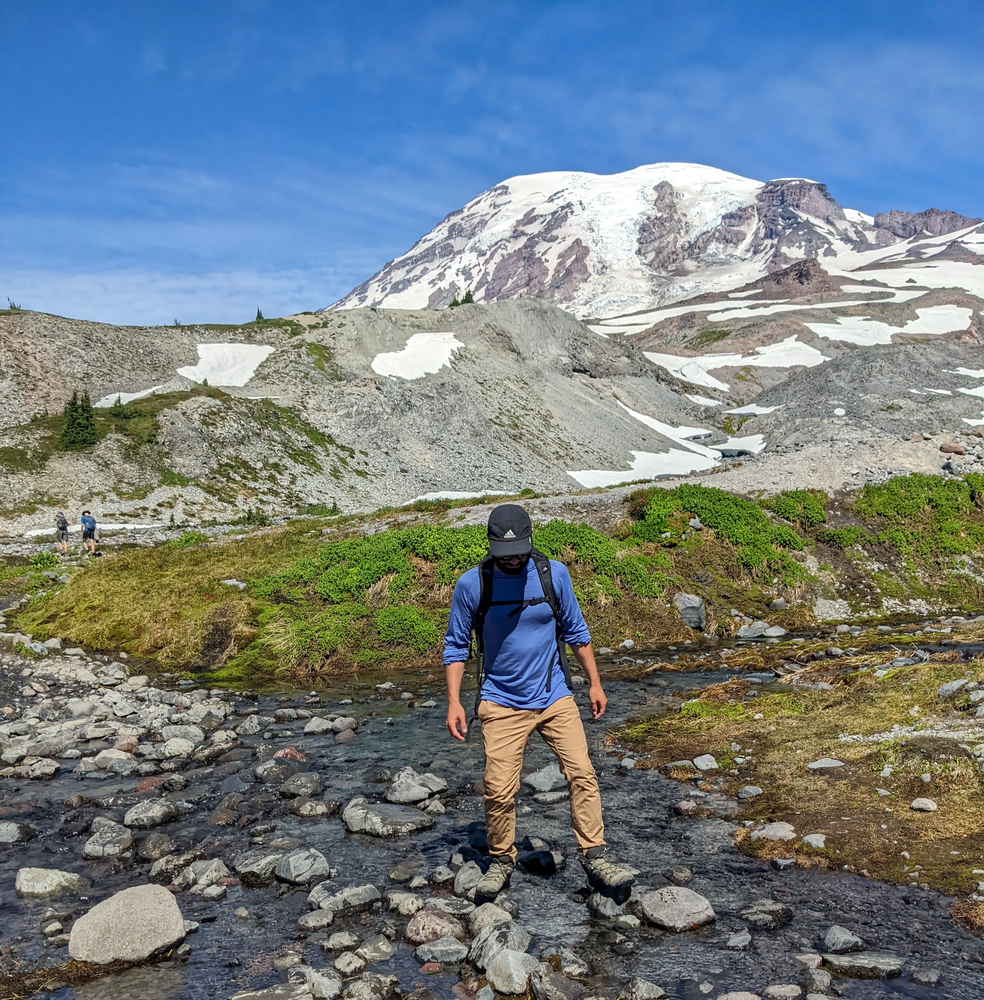

A year ago I left my 9-5 as a civil engineer in Boston. My wife and I decided it was time for a hard reset. So we took off in a converted church van to travel the US. 

We spent everyday hiking and seeing new places -- it was the best year of my life. 

Our travels landed us in Far West Texas, where we now live off-grid with our dog Bernie. 

My favorite colors for new layers in CAD are  140 &  101.

---

*Thanks to [Nuno Coração](https://nunocoracao.com/) for building [Blowfish](https://blowfish.page/)! The free [Hugo](https://gohugo.io/) theme used to build this site. Find an issue? [Let me know on GitHub.](https://github.com/kmalloy24/kylemalloy.com)*