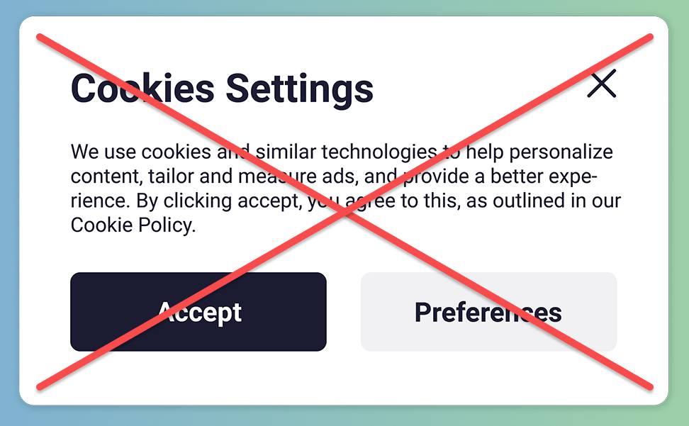


A free Google Analytics alternative with better UI/UX and complete privacy for your users.


## Why use Vercel Analytics?

### #1 Privacy

Data privacy has become a mainstream concern. Rather than giving up your user's data to big tech when using a tool like [Google Analytics](https://marketingplatform.google.com/about/analytics/), you can build trust with your users, and only store anonymized data. Vercel Analytics [does not use cookies](https://vercel.com/docs/analytics#how-visitors-are-determined), and is [GDPR Compliant](https://vercel.com/docs/security#gdpr), so no need for an annoying cookie disclaimer on your site.



Other privacy first options include,

- [Fathom (paid)](https://usefathom.com/)
- [Umami (open-source, self-hosted)](https://umami.is/)

### #2 Integrated Infrastructure

Having analytics built into Vercel means that if you are already hosting your project there then you can keep things all on one platform rather than using multiple third-party services. This is especially powerful when taking advantage of other Vercel features like [Speed Insights](/blog/vercel-speed-insights/), and overall makes makes for an excellent DX.

### #3 Usability

The analytics dashboard's UI is simple and easy to use - so you can spend less time digging for the data you want to see.

## Configure Vercel Analytics with Sveltekit in 3 Lines of Code

It's easy to setup Vercel Analytics in your app no matter what framework you're using. But Sveltekit makes it dead simple, and the setup is the same whether you are using JS or TS. For setup in other frameworks, and the most up to date information, refer to the [official quickstart](https://vercel.com/docs/analytics/quickstart) in the Vercel Docs.

I'm going to quickly go thorough the steps and then a few issues I ran into on my project.

### 1. Enable Web Analytics

On the [Vercel dashboard](https://vercel.com/dashboard), select your Project, then click enable on the Analytics tab.


Enabling Web Analytics will add new routes (scoped at /_vercel/insights/*) after your next deployment.

### 2. Add `@vercel/analytics` to your project

For npm, run -- `npm i @vercel/analytics`

### 3. Call the `inject` function in `src/routes/+layout.svelte`

Add the following 3 lines of code into the `<script>` tag of your root layout.

```ts
import { dev } from '$app/environment';
import { inject } from '@vercel/analytics'; 

inject({ mode: dev ? 'development' : 'production' });
```

### 4. Deploy

1. Deploy your app using `vercel deploy` or if your [git repo is connected](https://vercel.com/docs/deployments/git#deploying-a-git-repository) then push the changes to your main branch.
2. Visit your site (See troubleshooting tip #2 below)
3. If everything is set up properly, you should be able to see a Fetch/XHR request in your browser's Network tab from /_vercel/insights/view when you visit any page.

### Troubleshooting

1. The docs have the code going into `+layout.js/ts`; however, it should just go into the `<script>` tag of `+layout.svelte`.
2. After the final step you will need to revisit your site to start tracking visitors. If you use an ad blocker make sure that it is disabled or visit the site initially from a different browser, otherwise your ad blocker will block the request.

### Limitations

- [Custom events](https://vercel.com/docs/analytics/custom-events) require a [Pro Plan](https://vercel.com/pricing).

---

## Resources

- [Vercel Analytics Docs](https://vercel.com/docs/analytics)
- [Fathom - Privacy-focused website analytics](https://usefathom.com/privacy-focused-web-analytics)
- [Umami Source Code](https://github.com/umami-software/umami)
