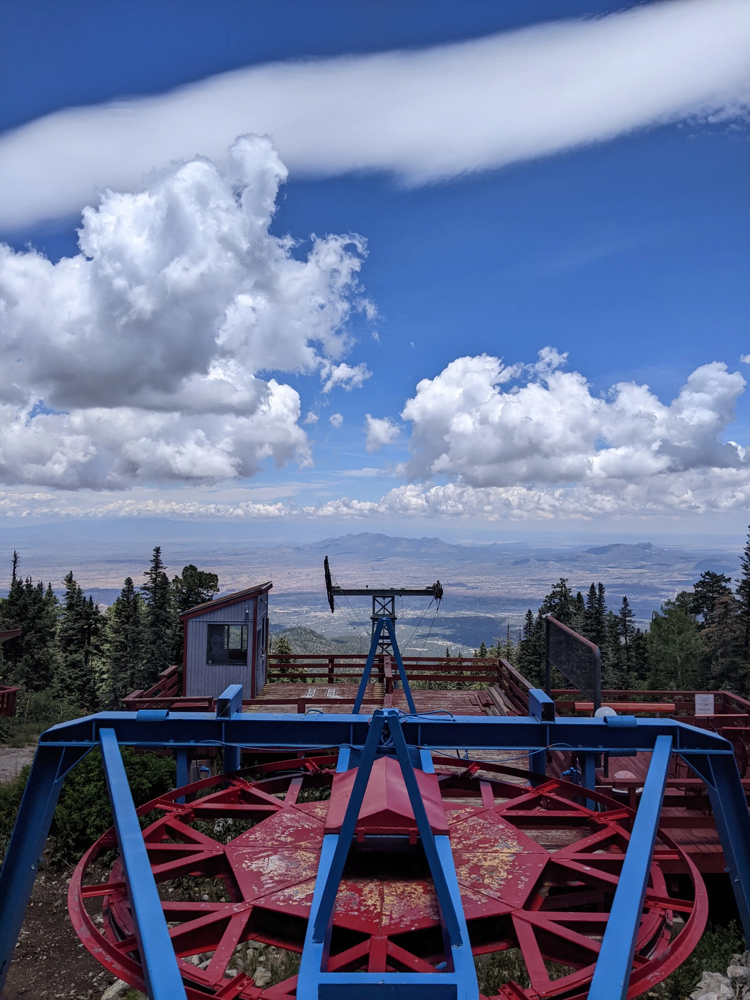
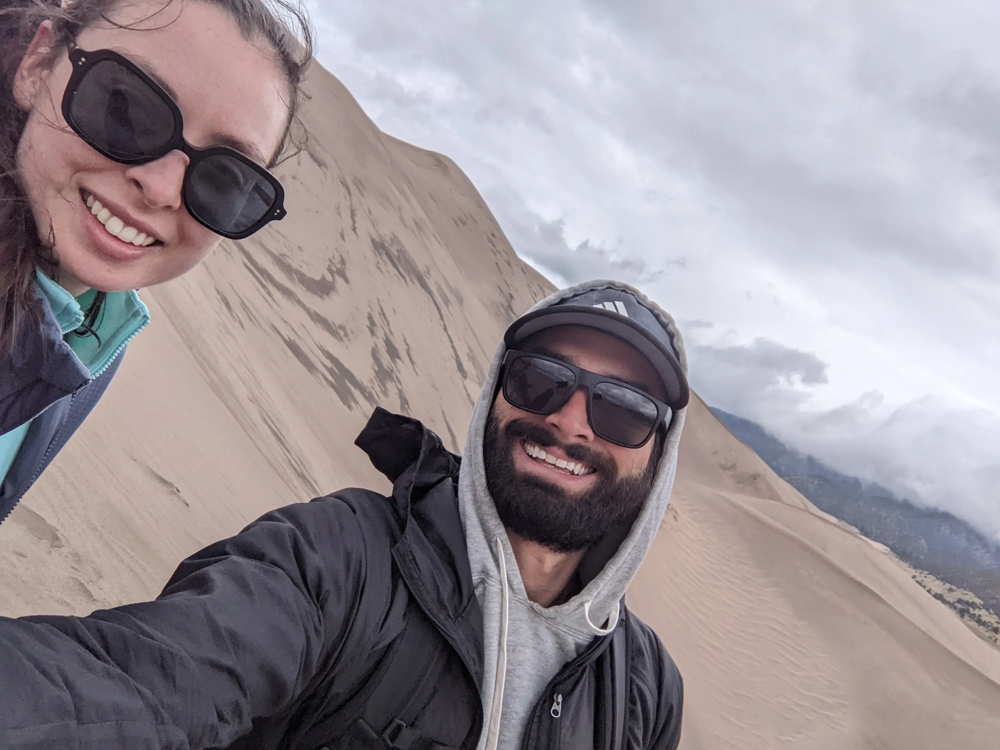
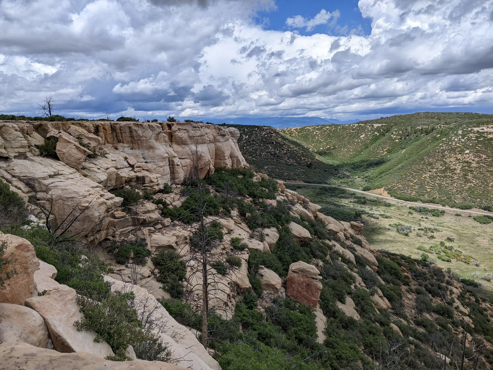
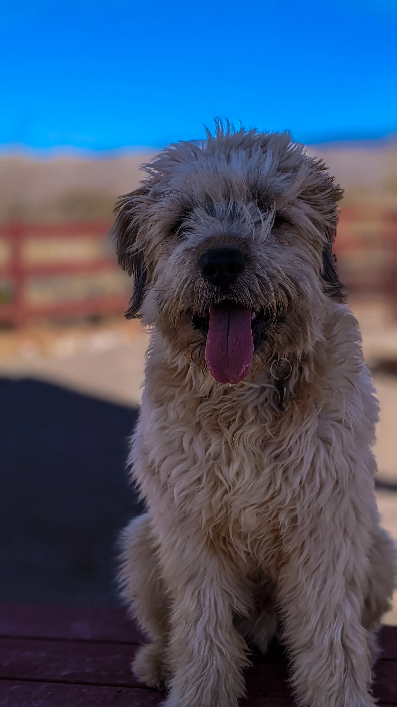
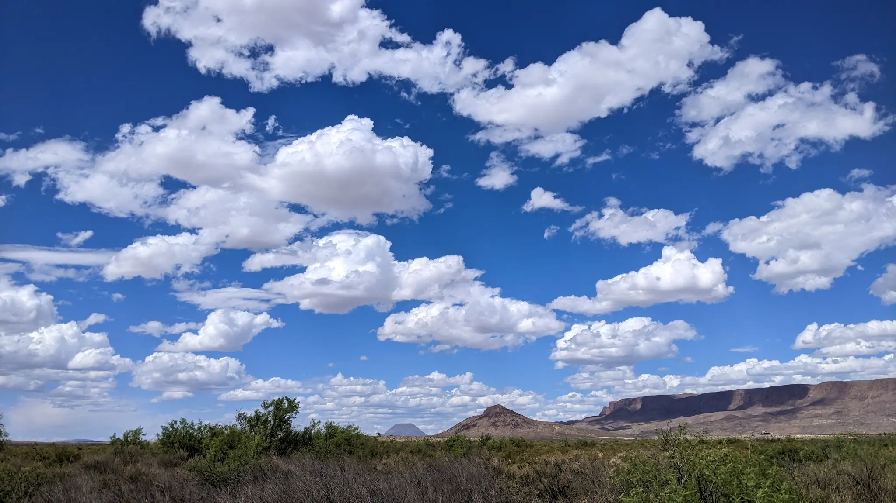
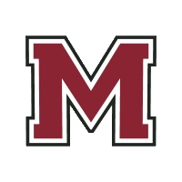
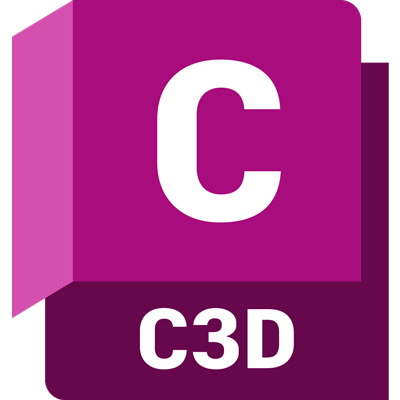
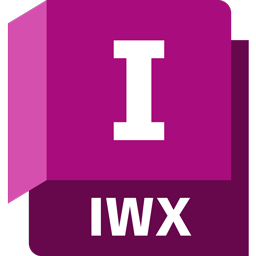
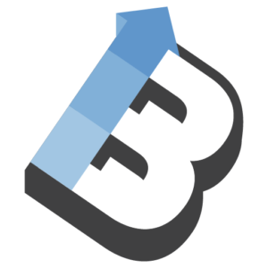

## Work Experience 


<!-- KM -->

 Remote  
<ul>
  <li>Providing roadway and site design services on a task-by-task basis or by retainer for up to 3 months.</li>
  <li>Developing practical <a href="/blog">training courses</a> for civil engineers</li>
  <li><a href="/blog">Writing</a> about intersections between Civil Engineering and Programming</li>
  <li>Built this website using 
  
  
   
  
  
  
  
  
  

  </li>
</ul>


<!--KM -->

<!-- CIVSOFT -->

 Remote    
Founded with my wife, Chandler, we are developing software solutions to improve workflows and give civil engineers time back in their day.

<!-- CIVSOFT -->

<!-- VAN -->

Took a year off to travel the country with my wife and develop an off-grid property in Far West Texas 🏜️
<h3>Vanlife</h3>

  
  
  
  
  

<ul>
  <li>🌎 2 countries, 12 states</li>
  <li>🏞️ 20 national parks</li>
  <li>🪧 97 trailheads 🥾 200 miles hiked 🗻 10,000' elev climbed</li>
  <li>🚐 15,000 miles driven</li>
  <li>🐶 1 dog adopted</li>
</ul>

<h3>Off-Grid</h3>

  

👆🏼 View from our backyard, DIY'd the following projects 👇🏼
<ul>
  <li>⚡ 1.2 kW solar system, w/ sun tracking robtic arm 🤖</li>
  <li>🚌 Mobile Home Renovation, electrical, plumbing, interior </li>
  <li>🛖 Shed Construction</li>
  <li>🚪 Tube Gate</li>
  <li>🌧️ Rain Catchment System</li>
  <li>♻️ Sustainable Compost & Recycling System</li>
  <li>🛻 Various repairs and maintenance on 97 Dodge Ram 🤦🏼‍♂️</li>
</ul>

<!-- VAN -->

<!-- HSH -->


<h2>Howard Stein Hudson</h2>
<h4>2012-1021 (4yr, 3mo)</h4>
 Boston, MA (2018-2020)   
 Remote (2020-2022)
<h3>Civil Engineer</h3>
<h3>Staff Civil Engineer (2018-2020)</h3>
<ul>
  <li>Coffee</li>
  <li>Tea</li>
  <li>Milk</li>
</ul>

<!-- HSH -->

<!-- GPR -->

With html code
<ul>
  <li>Coffee</li>
  <li>Tea</li>
  <li>Milk</li>
</ul>

<!-- GPR -->

<!-- GSA -->

Lorem ipsum dolor sit amet, consectetur adipiscing elit. Vivamus non magna ex. Donec sollicitudin ut lorem quis lobortis. Nam ac ipsum libero. Sed a ex eget ipsum tincidunt venenatis quis sed nisl. Pellentesque sed urna vel odio consequat tincidunt id ut purus. Nam sollicitudin est sed dui interdum rhoncus. 

<!-- GSA -->



## Education

<table>
    <thead>
        <tr>
            <th>School</th>
            <th></th>
            <th>Degree</th>
            <th>Date</th>
        </tr>
    </thead>
    <tbody>
        <tr>
            <td rowspan=1></td>
            <td>University of Massachusetts Amherst</td>
            <td>BS Mechanical Engineering</td>
            <td>2015</td>
        </tr>
    </tbody>
</table>

## Licsense and Certifications

<table>
    <thead>
        <tr>
            <th></th>
            <th></th>
            <th>Issued</th>
            <th>Credential</th>
        </tr>
    </thead>
    <tbody>
      <tr>
          <td rowspan=1></td>
          <td><a href="https://ncees.org/">Professional Engineer (PE)</a></td>
          <td>Dec 2021</td>
          <td><a href="https://elicensing21.mass.gov/CitizenAccess/GeneralProperty/LicenseeDetail.aspx?LicenseeNumber=56995&LicenseeType=Civil+Engineer">MA #56995</a></td>
      </tr>
    </tbody>
    <tbody>
      <tr>
          <td rowspan=2></td>
          <td><a href="https://www.psmj.com/PMBC1">AEC PM Bootcamp</a></td>
          <td>Mar 2020</td>
          <td><a href="pm-bootcamp.pdf">Course #10513</a></td>
      </tr>
    </tbody>
</table>

## Software

<table>
    <thead>
        <tr>
            <th></th>
            <th></th>
        </tr>
    </thead>
    <tbody>
      <tr>
          <td rowspan=2></td>
          <td>AutoCAD Civil 3D</td>
      </tr>
    </tbody>
    <tbody>
      <tr>
          <td rowspan=2></td>
          <td>Infraworks</td>
      </tr>
    </tbody>
        <tbody>
      <tr>
          <td rowspan=2></td>
          <td>BeyondCAD</td>
      </tr>
    </tbody>
        <tbody>
      <tr>
          <td rowspan=2></td>
          <td>HydroCAD</td>
      </tr>
    </tbody>
        <tbody>
      <tr>
          <td rowspan=2></td>
          <td>Bluebeam</td>
      </tr>
    </tbody>
        <tbody>
      <tr>
          <td rowspan=2></td>
          <td>Excel</td>
      </tr>
    </tbody>
</table>

## Skills
### Technical 
* roadway design
  * complex corridor modelling
  * complete streets/multimodal transportation design
  * ADA 
* site design
* subdivision 
* feasiblity studieies/zoning analysis
* grading
* stormwater management
  * subsurface system design
* utility design
  * sewer, incl pumps
  * profiles
* 3d visualizations
* cost estimating
* special provision writing
* technical memo writing 

### soft 
* excellent communication
* verbal and written
  * clients
    * managing expecttations
  - internal teams
    - traffic 
    - construction
  - external consultants 
    - architects
    - srveryors
    - environmental scientists 
* technical understanding of pavement markings, traffic signals, temporary traffic control, construction processes 
  * provides ability to collaborate with traffic and construction teams to avoid design conflicts 

## Projects

Full listing of all the projects that I've worked on (that i can remember) [projects]() 
