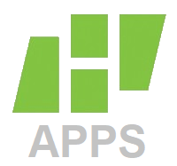
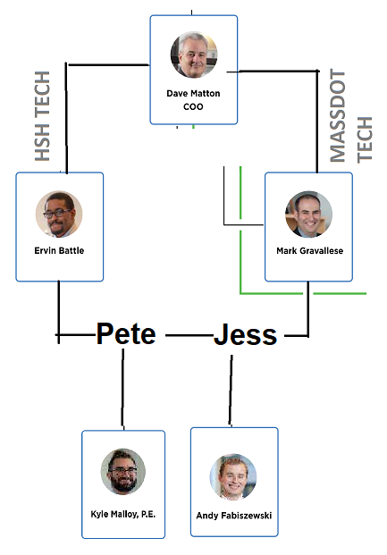

## What is HSH Apps?
HSH Apps is a new team at Howard Stein Hudson that is focused on building web based applications for clients and internal processes.

## What is the big picture?
1. Develop apps for MassDOT
2. Develop apps internally
3. Apply products built and lessons learned from steps #1 & 2 to build and sell software to other consultants and public entities

## Why does Howard Stein Hudson need HSH Apps?
HSH Apps offers 4️⃣ distinctive advantages
1. Build and sell software as a service (SaaS) apps to clients, and other consultants in the AEC industry, tapping into the [best business model 📈]( "Why SaaS is the Best Business Model").

2. Leverage existing public sector clients to build and sell tailor-made software as a professional service.
3. Reduce company software licensing costs by building these apps internally.
	1. This includes websites, like [hshassoc.com](https://hshassoc.com), where support and hosting costs would be eliminated. 
4. Build custom internal apps - providing [many benefits ⚙️]( "Internal Benefits of HSH Apps"), including
	1. More competitive bids on T&M contracts
	2. Same bid on T&M contracts but more time for on the job staff training 
	3. More take home on fixed fee contracts

## What is needed for HSH Apps to be successful?
- Adequate budget for staff and software licenses
- Unanimous support from leadership
- Alignment of values with Howard Stein Hudson
- Patience while achieving profitability
	- The structural team was largely unbillable for the first year
	- Took a while for Pete to start getting pavement work
	- This will be no different, however, we have SARPET to already get started on which is a huge risk mitigator as a proof of concept

## Where does this fit into the existing reporting structure and the 5 year plan?

## How will we track accountability?
- New accounting code for hsh app work
- Set periodic internal check-ins 
- Detailed B/C analysis before go/no

---

## That sounds great! But why trust [this guy](https://kylemalloy.com/) 🤔?

### Why I am the person to do it
- Unique intersection of civil engineering and software development skills
	- Can bridge the gap between the two, ask the right questions, and get the right answers when we hit a wall
- Broad industry knowledge
- Cross-department company knowledge
- I adapt and learn quickly

### Why I want to do it
- It's what interests and excites me
- Lower risk than a startup
- Higher chance of success with HSH resources 
- Coming off a year of rest and hungry for a challenge

### My 5 year plan
- Start a family
- Buy a house in upstate New York
- Successfully Deploy SARPET and use it as a springboard for future MassDOT Excel to web app contracts
- Develop HSH Apps into a $1M ARR (annual recurring revenue) business  


**For Context**
BSCES has 3200 members, if they all used HSH Apps @ $25/month it's ~$1M ARR, roughly 1% of CEs in the US

The [BLS](https://www.bls.gov/oes/current/oes172051.htm) estimates 6,500 CEs in Boston metro, 7,300 in state, 310,000 nationwide 


### What I am asking
<!-- - $120k full time salary position w/ benefits  -->
- To be the lead on HSH Apps and it's direction
- No civil engineering design work
	- First year 15% billable target from SARPET
    	- Contract to include 2 months of full-time work for me
	- Second year review billable goals
	- Save $3,500 on my Autodesk license 

### Examples of my work

#### Websites 🌐
- [My personal website](https://kylemalloy.com)
which [out performs](https://pagespeed.web.dev/analysis/https-kylemalloy-com/gytng5yvsc?form_factor=mobile) the HSH [website](https://pagespeed.web.dev/analysis/https-hshassoc-com/ytkpwpl9i9?form_factor=mobile) by every metric on mobile and desktop, and costs me $0.
- [Vanlife blog](https://atomsofus.com/)

#### Web Apps 📱
| Project | Description |
| - | - |
|[Linktree Clone](https://fkit-peach.vercel.app/) | Web app with user authentication and profile creation like [linktree](https://linktree.com/) |
|Business Plan & Pitch Deck|Web based slide deck using the same tech as [slides.com](https://slides.com/)|
|SARPET Prototype|Frontend layout example for MassDOT|

---

## Next Steps ✅
1. Land MassDOT contract to make SARPET into a web app
2. Organize these notes into a more comprehensive business plan and half hour PowerPoint presentation for the board