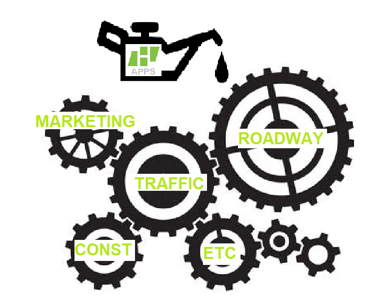

## A holistic approach to internal pain points


Build processes that are system dependent -- not people dependent 

## Build systems that scale
- HSH is a growing mid-sized local company hitting the ceiling in MA and needs to streamline processes on top of it's solid foundation in order to continue to grow
- Solidify best practices, reduce error prone excel and word workflows, less time spent locating things, asking questions that have already been answered. 
- Software processes are data drive and can provide knowledge capture from employees that can benefit the company even after they part ways
- If a business is setup with simple and well oiled processes, you should be able to get a person with the bare minimum qualifications to output good work. 
	- If you're dependent on good people to output good work then you will hit a bottleneck eventually 

## Employee Retention, Attraction, & Utilization 
- Less busy work and helpful tools that make days easier than at other companies
- Good tooling minimizes the gap between top performers and low performers 
- Stop competing for, highly trained - top talent, and build systems that enable highly effective entry level people and scales with them
- Younger people want to see the company is keeping up with new tech and taking an exciting approach to problems, especially in a largely archaic industry 
- More resilience in difficult hiring times

## Some ideas for internal apps
- Main login portal for all things HSH
- New project intake/jcs tooling and hsh project database with projects mapped out
- Internal docs
- Digital reference and design guidance library 
- Forums
- Revamped HSH academy with full blown courses
- Hosting for spec and cad detail library w full search
- In/out
- Hsh in the news and archive database, searchable
- Blog post archives, searchable
- Lead generation from local municipalities using AI
- Project websites
- Enhanced analytics
- Smart spreadsheets/databases, w analytics, pretty graphs, data type validity, make better connections w data - gain powerful insights, spend less time editing and formatting excel 
	- Workload trackers 
	- Project budgets
	- Lead tracker