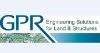
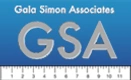
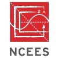
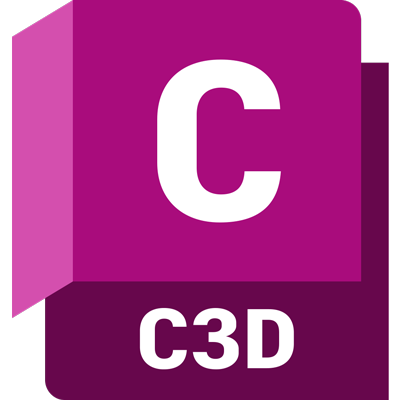
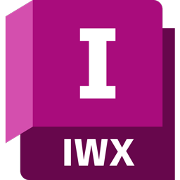

## Work Experience 



<!-- CIVSOFT -->
<!-- 
 Remote    
Founded with my wife, Chandler, we are developing software that provides value by improving workflows and giving civil engineers more time back in their day.
 -->
<!-- CIVSOFT -->

<!-- HSH -->


<h2>Howard Stein Hudson</h2>
<h4>Oct 2018 - Current · 4 yrs 8 mos</h4>
 Remote (2020-2022)
 Boston, MA (2018-2020)   
<h3>Civil Engineer, Part-Time (Apr 2022 - Current)</h3>
Working remotely on a part-time basis. 
<h3>Civil Engineer (Oct 2018 - Apr 2022)</h3>
As a roadway design engineer in the public Infrastructure department, I developed plans, performed technical analysis/documentation, and cost estimates, for private and municipal clients. Depending on the project, designs considered accommodations for vehicular, pedestrian, bicycle, and public transit users.

<!-- HSH -->

<!-- VAN -->

<h2>Extended Honeymoon</h2>
<h4>April 2022 - April 2023 · 1 yr</h4>
Took a year off to travel the country with my wife and develop an off-grid property in Far West Texas 🏜️  
<h3>Vanlife</h3>

  
  
  
  
  

<ul>
  <li>🌎 2 countries, 11 states</li>
  <li>🏞️ 23 national parks</li>
  <li>🥾 71 trails</li>
  <li>🚐 12,000 miles</li>
  <li>🐶 1 dog adopted</li>
</ul>
<h3>Off-Grid</h3>

  

👆🏼 View from our backyard, DIY'd the following projects 👇🏼
<ul>
  <li>⚡ 1.2 kW solar system, w/ sun tracking robotic arm 🤖</li>
  <li>🚌 Mobile home renovation, electrical, plumbing, interior </li>
  <li>🛖 Shed construction</li>
  <li>🚪 Tube gate</li>
  <li>🌧️ Rain catchment system</li>
  <li>♻️ Sustainable compost & recycling system</li>
  <li>🛻 Various repairs and maintenance on 97 Dodge Ram 🤦🏼‍♂️</li>
</ul>

<!-- VAN -->

<!-- GPR -->


<h2>Goldsmith, Prest & Ringwall, Inc.</h2>
<h4>May 2017 - Oct 2018 · 1 yr 6 mos</h4>
 Ayer, MA  
<h3>Staff Civil Engineer</h3>
<ul>
  <li>Worked on various types of land development projects, including, commercial, industrial, subdivisions, retirement communities, solar array facilities, and more</li>
  <li>Prepared conceptual, permitting, construction and as-built drawings for a variety of projects using AutoCAD</li>
  <li>Created hydrological models and designed stormwater management systems with HydroCAD software</li>
  <li>Performed and analyzed design calculations for MassDEP Stormwater Standards</li>
  <li>Designed utility systems and prepared profiles using AutoCAD 3D features</li>
  <li>Wrote technical reports, business correspondence, and memos</li>
  <li>Prepared permit applications for, and communicated with, local, state, and federal agencies</li>
  <li>Gained experience with projects in conservation jurisdiction, including floodplain mitigation</li>
  <li>Developed detailed project cost estimates </li>
  <li>Provided construction level specifications</li>
</ul>

<!-- GPR -->

<!-- GSA -->


<h2>Gala Simon Associates, Inc.</h2>
<h4>2013 - 2017 · 4 yrs</h4>
 Lexington, MA  
<h3>Staff Civil Engineer (July 2015 - May 2017)</h3>
<ul>
  <li>Worked on various types of land development projects, including, residential (single and multi-family), commercial, roadways, subdivisions, municipal recreational parks, and more</li>
  <li>Prepared conceptual, permitting, construction and as-built drawings for a variety of projects using AutoCAD</li>
  <li>Created hydrological models and designed stormwater management systems with HydroCAD software</li>
  <li>Coordinated with clients, contractors, and multi-disciplinary teams of outside consultants</li>
  <li>Presented project plans to municipal agencies and the public</li>
  <li>Performed construction inspections</li>
  <li>Generated EPA NPDES Stormwater Pollution Prevention Plans (SWPPP)</li>
  <li>Gained knowledge and on-site experience of soil testing</li>
</ul>
<h3>Intern (June 2013 - June 2015)</h3>

<!-- GSA -->



## Education

<table>
    <thead>
        <tr>
            <th>School</th>
            <th></th>
            <th>Degree</th>
            <th>Date</th>
        </tr>
    </thead>
    <tbody>
        <tr>
            <td rowspan=1></td>
            <td>University of Massachusetts Amherst</td>
            <td>BS Mechanical Engineering</td>
            <td>2015</td>
        </tr>
    </tbody>
</table>

## Licsense and Certifications

<table>
    <thead>
        <tr>
            <th></th>
            <th></th>
            <th>Issued</th>
            <th>Credential</th>
        </tr>
    </thead>
    <tbody>
      <tr>
          <td rowspan=1></td>
          <td><a href="https://ncees.org/">Professional Engineer (PE)</a></td>
          <td>Dec 2021</td>
          <td><a href="https://elicensing21.mass.gov/CitizenAccess/GeneralProperty/LicenseeDetail.aspx?LicenseeNumber=56995&LicenseeType=Civil+Engineer">MA #56995</a></td>
      </tr>
    </tbody>
    <tbody>
      <tr>
          <td rowspan=2></td>
          <td><a href="https://www.psmj.com/PMBC1">AEC PM Bootcamp</a></td>
          <td>Mar 2020</td>
          <td><a href="pm-bootcamp.pdf">Course #10513</a></td>
      </tr>
    </tbody>
</table>

## Software

<table>
    <thead>
        <tr>
            <th></th>
            <th></th>
        </tr>
    </thead>
    <tbody>
      <tr>
          <td rowspan=2></td>
          <td>AutoCAD Civil 3D</td>
      </tr>
    </tbody>
    <tbody>
      <tr>
          <td rowspan=2></td>
          <td>Infraworks</td>
      </tr>
    <!-- </tbody>
        <tbody>
      <tr>
          <td rowspan=2></td>
          <td>BeyondCAD</td>
      </tr>
    </tbody> -->
        <tbody>
      <tr>
          <td rowspan=2></td>
          <td>HydroCAD</td>
      </tr>
    </tbody>
        <tbody>
      <tr>
          <td rowspan=2></td>
          <td>Bluebeam</td>
      </tr>
    </tbody>
        <tbody>
      <tr>
          <td rowspan=2></td>
          <td>Excel</td>
      </tr>
    </tbody>
</table>

## Skills
### Roadway Design
* Experience designing:
  * Roundabouts
  * Intersections
  * Highway entrance and exit ramps
  * Local, collector, and arterial roads
  * On and off road bicycle facilities 
  * Complete streets / multimodal transportation design
  * Raised crossings and intersections 
  * On street parking facilities 
* ADA compliant design for sidewalks, bus stops, and pedestrian ramps 
* AASHTO Greenbook complaint design
  * Design speed
  * Horizontal and vertical alignments
  * Sight distance
  * Design vehicles, turning movements with AutoTURN
* Roadside Design Guide compliant design
  * Roadside and median barriers
  * Workzone safety 
  * Clear zones 
  * Country drainage 
  * Erosion control
* MUTCD, familiar with 
  * Signage, pavement markings, temporary traffic control measures 
* Utilities 
  * Catch basin relocation
  * Identifying, modifying or designing around existing conflicts with surface level utility covers, small cell antennas, underground telecom lines or vaults, gas lines, etc. 
  * Relocating utility poles, light poles, handholes, conduit, etc. 
* Corridor modelling in Civil 3D
* 3D project visualization using Infraworks 
* Environmental checklists 
* Cost estimating
* Special provision writing
* Technical memo writing 

### Site Design
* Experience designing:
  * Residential lots - multi and single family
  * Subdivisions
  * Commercial properties
  * Parking lots
  * Solar farms
  * Affordable housing developments (40B in MA)
  * Senior living facilities
  * Condominium complexes
  * Municipal parks 
  * Industrial - cement concrete mixing plant
  * Self storage units 
* Feasibility studies/zoning analysis
* Grading and drainage plans
* Demolition and erosion control plans
* Stormwater management
  * Existing vs proposed modelling and analysis in HydroCAD
  * Stormwater report writing
  * Subsurface system design
  * Design of retention and detention ponds, swales, tree boxes, rain gardens, and proprietary treatment chambers
* Extensive experience with work near environmentally sensitive areas; such as, wetlands, riverfront, floodzones, and floodways
  * Local, state and federal permitting
  * Floodplain reclamation 
* Utility plans & profiles
  * Sewer design, including pumps
  * Water line connections
  * Stormwater overflows to the street 
  * Some septic system design 
  
### Project Management  
* Review unbilleds, coordinate with accounting on invoices and project expenses 
* Track team member hours and budget 
* Writing scopes and estimating fees for proposals 
* Developing project schedules
* Strict adherence to deadlines, and continual updates on progress to project stakeholders 
* Experience working on fixed fee and time and material projects 
* Ability to manage client expectations when scope creep happens 
* Understanding of how a professional services company makes money 
* Excellent verbal and written communication 
* Clear coordination and delegation amongst project teams 
* Organize concise and focused meetings 
* Experience managing multiple projects simultaneously
* Ability to prioritize and use effective time management techniques  
* Structured maintenance of project file folders, team documents, and assurance of cleanly drafted plans 
* Understanding of multidisciplinary roles within a project team. I have worked with traffic, construction, survey, graphics/marketing, and accounting teams internally, as well as, architects, surveyors, and environmental scientists externally.
* Have been the design lead on private mitigation projects
* Have managed projects with municipal and state clients 