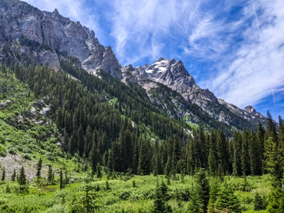
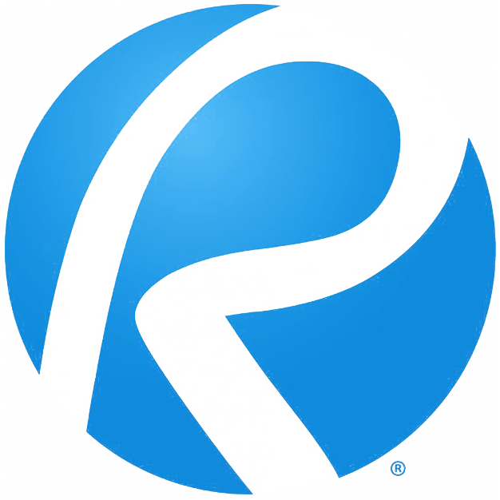

## Work Experience 


<!-- KM -->

 Remote  
<ul>
  <li>Providing roadway and site design services, directly to consultants and agencies, on a task-by-task basis, or by retainer for up to 3 months.</li>
  <!-- <li>Developing practical <a href="/blog">training courses</a> for civil engineers</li>
  <li><a href="/blog">Writing</a> about intersections between Civil Engineering and Programming</li> -->
  <li>Built this website using 
  
  
   
  
  
  
  
  
  

  </li>
</ul>


<!--KM -->

<!-- CIVSOFT -->

 Remote    
Founded with my wife, Chandler, we are developing software solutions to improve workflows and give civil engineers more time back in their day.

<!-- CIVSOFT -->

<!-- VAN -->

Took a year off to travel the country with my wife and develop an off-grid property in Far West Texas 🏜️
<h3>Vanlife</h3>

  
  
  
  
  

<ul>
  <li>🌎 2 countries, 12 states</li>
  <li>🏞️ 20 national parks</li>
  <li>🪧 97 trailheads 🥾 200 miles hiked 🗻 10,000' elev climbed</li>
  <li>🚐 15,000 miles driven</li>
  <li>🐶 1 dog adopted</li>
</ul>

<h3>Off-Grid</h3>

  

👆🏼 View from our backyard, DIY'd the following projects 👇🏼
<ul>
  <li>⚡ 1.2 kW solar system, w/ sun tracking robotic arm 🤖</li>
  <li>🚌 Mobile home renovation, electrical, plumbing, interior </li>
  <li>🛖 Shed construction</li>
  <li>🚪 Tube gate</li>
  <li>🌧️ Rain catchment system</li>
  <li>♻️ Sustainable compost & recycling system</li>
  <li>🛻 Various repairs and maintenance on 97 Dodge Ram 🤦🏼‍♂️</li>
</ul>

<!-- VAN -->

<!-- HSH -->


<h2>Howard Stein Hudson</h2>
<h4>2012-1021 (4yr, 3mo)</h4>
 Boston, MA (2018-2020)   
 Remote (2020-2022)
<h3>Civil Engineer</h3>
<h3>Staff Civil Engineer (2018-2020)</h3>
<ul>
  <li>Coffee</li>
  <li>Tea</li>
  <li>Milk</li>
</ul>

<!-- HSH -->

<!-- GPR -->


<h2>Goldsmith, Prest & Ringwall, Inc.</h2>
<h4>May 2017 - Oct 2018 · 1 yr 6 mos</h4>
 Ayer, MA  
<h3>Staff Civil Engineer</h3>
<ul>
  <li>Worked on various types of land development projects, including, commercial, industrial, subdivisions, retirement communities, solar array facilities, and more</li>
  <li>Prepared conceptual, permitting, construction and as-built drawings for a variety of projects using AutoCAD</li>
  <li>Created hydrological models and designed stormwater management systems with HydroCAD software</li>
  <li>Performed and analyzed design calculations for MassDEP Stormwater Standards</li>
  <li>Designed utility systems and prepared profiles using AutoCAD 3D features</li>
  <li>Wrote technical reports, business correspondence, and memos</li>
  <li>Prepared permit applications for, and communicated with, local, state, and federal agencies</li>
  <li>Gained experience with projects in conservation jurisdiction, including floodplain mitigation</li>
  <li>Developed detailed project cost estimates </li>
  <li>Provided construction level specifications</li>
</ul>

<!-- GPR -->

<!-- GSA -->


<h2>Gala Simon Associates, Inc.</h2>
<h4>2013 - 2017 · 4 yrs</h4>
 Lexington, MA  
<h3>Staff Civil Engineer (July 2015 - May 2017)</h3>
<ul>
  <li>Worked on various types of land development projects, including, residential (single and multi-family), commercial, roadways, subdivisions, municipal recreational parks, and more</li>
  <li>Prepared conceptual, permitting, construction and as-built drawings for a variety of projects using AutoCAD</li>
  <li>Created hydrological models and designed stormwater management systems with HydroCAD software</li>
  <li>Coordinated with clients, contractors, and multi-disciplinary teams of outside consultants</li>
  <li>Presented project plans to municipal agencies and the public</li>
  <li>Performed construction inspections</li>
  <li>Generated EPA NPDES Stormwater Pollution Prevention Plans (SWPPP)</li>
  <li>Gained knowledge and on-site experience of soil testing</li>
</ul>
<h3>Intern (June 2013 - June 2015)</h3>

<!-- GSA -->



## Education

<table>
    <thead>
        <tr>
            <th>School</th>
            <th></th>
            <th>Degree</th>
            <th>Date</th>
        </tr>
    </thead>
    <tbody>
        <tr>
            <td rowspan=1></td>
            <td>University of Massachusetts Amherst</td>
            <td>BS Mechanical Engineering</td>
            <td>2015</td>
        </tr>
    </tbody>
</table>

## Licsense and Certifications

<table>
    <thead>
        <tr>
            <th></th>
            <th></th>
            <th>Issued</th>
            <th>Credential</th>
        </tr>
    </thead>
    <tbody>
      <tr>
          <td rowspan=1></td>
          <td><a href="https://ncees.org/">Professional Engineer (PE)</a></td>
          <td>Dec 2021</td>
          <td><a href="https://elicensing21.mass.gov/CitizenAccess/GeneralProperty/LicenseeDetail.aspx?LicenseeNumber=56995&LicenseeType=Civil+Engineer">MA #56995</a></td>
      </tr>
    </tbody>
    <tbody>
      <tr>
          <td rowspan=2></td>
          <td><a href="https://www.psmj.com/PMBC1">AEC PM Bootcamp</a></td>
          <td>Mar 2020</td>
          <td><a href="pm-bootcamp.pdf">Course #10513</a></td>
      </tr>
    </tbody>
</table>

## Software

<table>
    <thead>
        <tr>
            <th></th>
            <th></th>
        </tr>
    </thead>
    <tbody>
      <tr>
          <td rowspan=2></td>
          <td>AutoCAD Civil 3D</td>
      </tr>
    </tbody>
    <tbody>
      <tr>
          <td rowspan=2></td>
          <td>Infraworks</td>
      </tr>
    </tbody>
        <tbody>
      <tr>
          <td rowspan=2></td>
          <td>BeyondCAD</td>
      </tr>
    </tbody>
        <tbody>
      <tr>
          <td rowspan=2></td>
          <td>HydroCAD</td>
      </tr>
    </tbody>
        <tbody>
      <tr>
          <td rowspan=2></td>
          <td>Bluebeam</td>
      </tr>
    </tbody>
        <tbody>
      <tr>
          <td rowspan=2></td>
          <td>Excel</td>
      </tr>
    </tbody>
</table>

## Skills
### Technical 
* roadway design
  * complex corridor modelling
  * complete streets/multimodal transportation design
  * ADA 
* site design
* subdivision 
* feasiblity studieies/zoning analysis
* grading
* stormwater management
  * subsurface system design
* utility design
  * sewer, incl pumps
  * profiles
* 3d visualizations
* cost estimating
* special provision writing
* technical memo writing 

### soft 
* excellent communication
* verbal and written
  * clients
    * managing expecttations
  - internal teams
    - traffic 
    - construction
  - external consultants 
    - architects
    - srveryors
    - environmental scientists 
* technical understanding of pavement markings, traffic signals, temporary traffic control, construction processes 
  * provides ability to collaborate with traffic and construction teams to avoid design conflicts 

