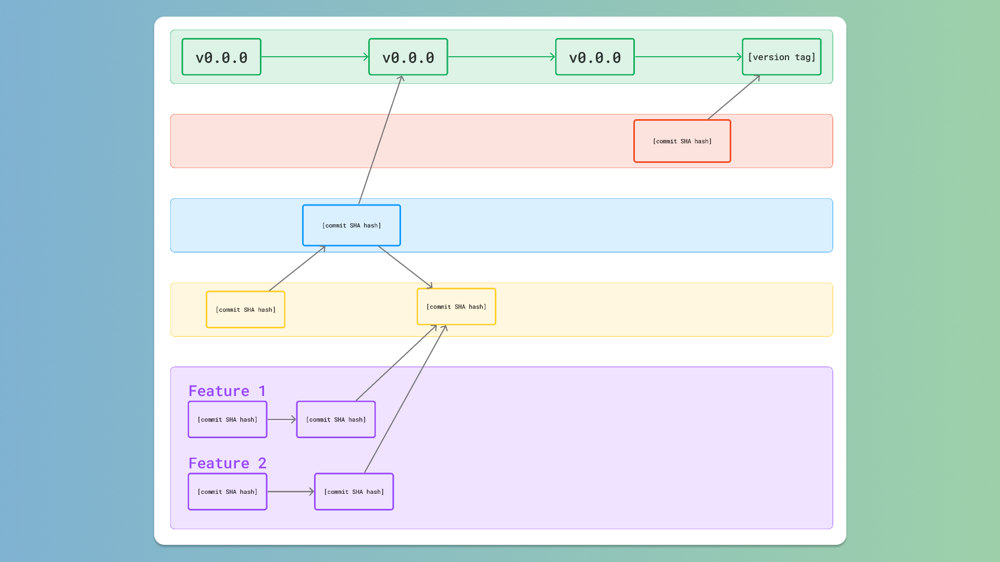


Helpful stuff for Civil Engineering & Web Development that I've made along the way.


---

## 💻 Web Development

### Figma

#### Git Branch Map

[Figma Community Link](https://www.figma.com/community/file/1298718431799316388/git-branch-map)

A template for FigJam to organize your project's branches and communicate them with your team.

---

<!-- ## 🌉 Civil Engineering -->

